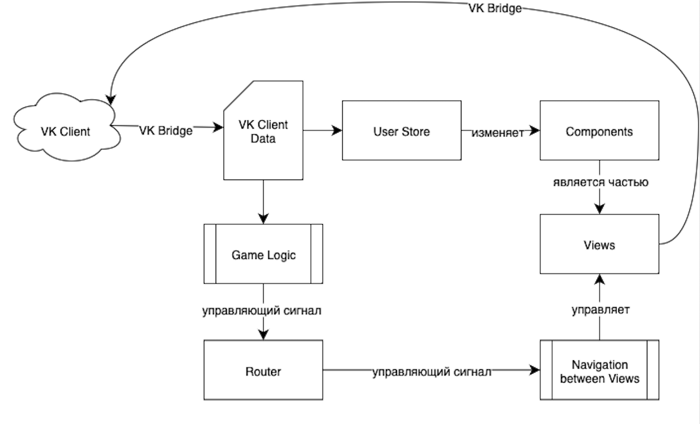

Основные команды для проекта:

- npm install - установка зависимостей
- npm run dev - запуск проекта на локалке

- npm run lint - запуск линтера (при работе проекта)
- npm run build - запуск сборки
- npm run preview - запуск проекта перед сборкой

- npm run deploy - деплой в вк
- npm run tunnel - создание туннеля для тестирования, для нормальной работы необходимо настроить проект через вк

- npm run test:unit - запуск тестов unit
- npm run test:unit:run - запуск одного теста unit
- npm run test:coverage - тесты с отчётом о покрытии
- npm run test:e2e - запуск тестов e2e

- npm run lint - проверяет синтаксис, неиспользуемые переменные, типичные ошибки (не исправляет)
- npm run lint:fix - исправляет автоматически исправимые ошибки ESLint
- npm run format - приводит код к единому стилю согласно правилам Prettier (с перезаписью)
- npm run format:check - только показывает какие файлы нуждаются в форматировании согласно правилам Prettier 
- npm run lint:format - объединение команд npm run format и npm run lint:fix

Выбранные технологии:

- Роутинг: Vue Router 4.
- Хранилище состояний: Pinia, зависимость установлена, можно подключать. 
- Линтер: ESLint + vue-eslint-plugin, настроен и работает.
- Сборка: Vite, настроена и работает.
- Система тестов: 
    - Unit: Vitest + jsdom, настроено и работает, реализован пример (была проблема с "@", учтена и исправлена в конфигах vite). Имеющийся тест выдаёт предупреждение - можно создать моку для router, но на данном этапе не является необходимостью.
    - Тестовое покрытие: @vitest/coverage-v8, настроено и работает.
    - E2E: Playwright, настроено и работает, реализован пример. 

Структура проекта: 

- config 
- node-modules - подключенные зависимости
- src - исходный код
    - assets - ресурсы (изображения, стили)
    - components - тут будут компоненты, которые будем переиспользовать (например, игровое поле)
    - router - настройка навигации
    - stores - хранилище состояний
    - utils
    - views - страницы приложения
    - App.vue - главный компонент 
    - main.js - подключение настроек
- tests
    - e2e
    - unit
        - components
        - stores
        - views
- index.html - точка входа
- package.json - описание проекта, скрипты и зависимости
- package-lock.json - контроль версий

Архитектура проекта:

  

Связь модулей:

  

